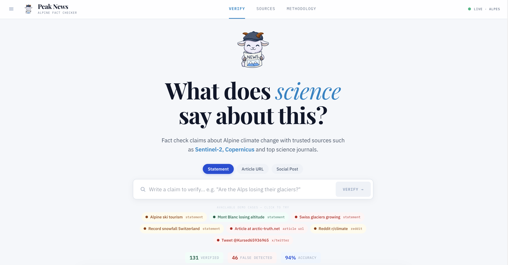
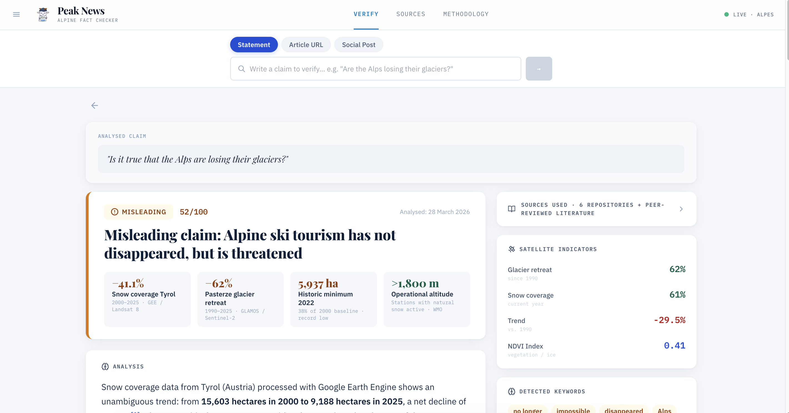
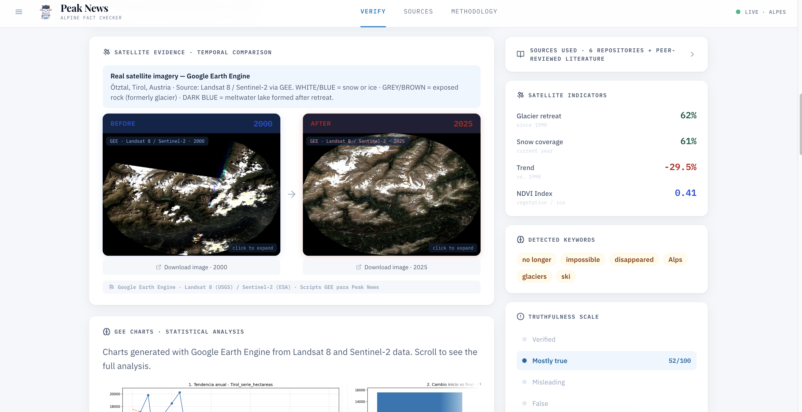
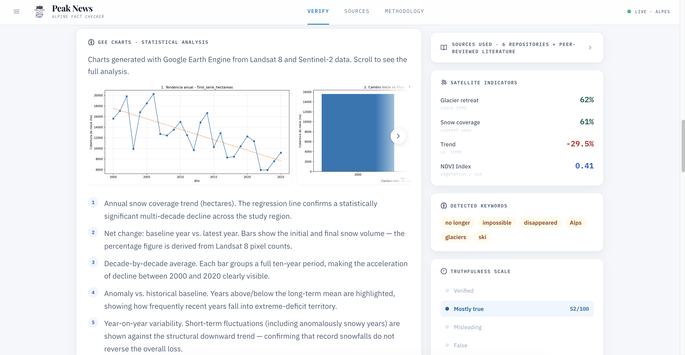
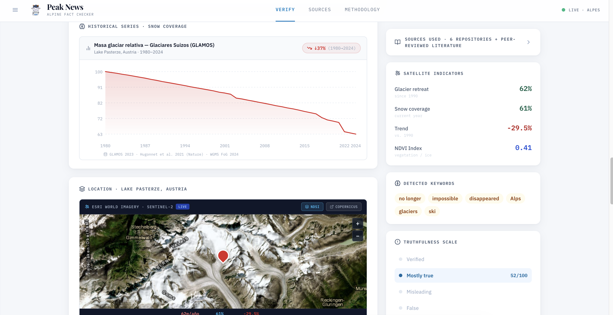
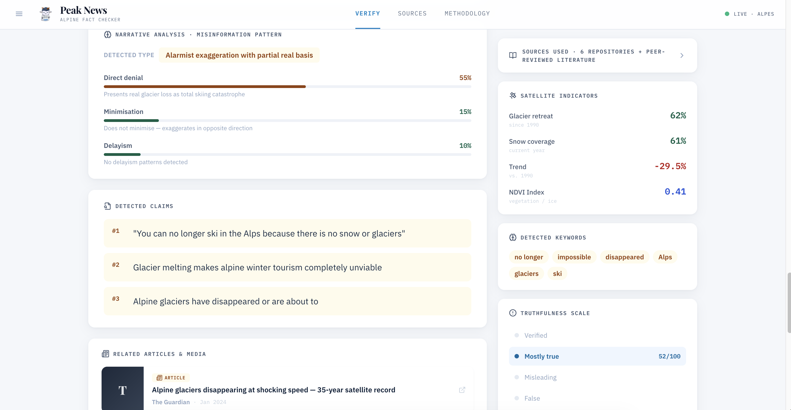
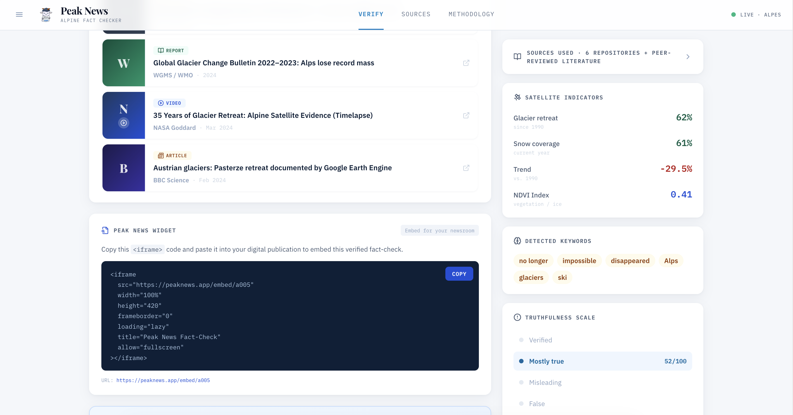

# Peak News

**An Alpine fact-checker that verifies climate claims against 35 years of satellite record.**

[](https://spacehack-2026.vercel.app)
[](https://react.dev)
[](https://www.typescriptlang.org)
[](https://fastapi.tiangolo.com)
[](https://earthengine.google.com)
[](#license)



---

## The problem

Claims about Alpine glaciers travel faster than the science that could confirm or debunk them. *"Swiss glaciers are growing thanks to record polar cold."* *"You can no longer ski in the Alps."* Both circulate widely; both are checkable against public satellite archives. But a journalist on deadline has no practical way to query Landsat and Sentinel-2, run the statistics, find the relevant literature, and turn all of it into something publishable — not in the twenty minutes they actually have.

**Peak News closes that gap.** Paste a statement, an article URL, or a social post. The tool returns a verdict grounded in Google Earth Engine imagery, a set of derived statistical charts, an NLP breakdown of the misinformation pattern being used, and an `<iframe>` embed the newsroom can drop straight into the published piece.

Built in 48 hours for **Space Hack 2026**.

---

## Walkthrough

### Verdict, at a glance

The result view leads with the verdict and a confidence score on a 0–100 scale, then the numbers that produced it. The right rail stays pinned throughout: satellite indicators, keywords flagged by the NLP pass, and the position of this claim on the truthfulness scale.



### Satellite evidence

Before/after imagery pulled from Google Earth Engine for the specific location the claim refers to, with the band composition and palette spelled out so the reader can tell snow from exposed rock from meltwater. Both frames are downloadable and expand on click.



### Statistical analysis

The imagery alone doesn't settle anything — a single warm summer is not a trend. Each analysis ships with the GEE-derived chart series behind it: annual trend with regression line, net change against baseline, decade averages, anomaly vs. historical baseline, and year-on-year variability. Every chart is annotated in plain language explaining what it does and does not prove.



Long-run series are cross-checked against GLAMOS glacier mass balance records, and the analysed location is pinned on a Sentinel-2 basemap.



### Narrative analysis

Beyond true/false, the tool characterises *how* a claim misleads. Three patterns are scored independently — direct denial, minimisation, and delayism — and the individual claims extracted from the source text are listed so the journalist can see exactly what is being asserted.



### Publishing

Related coverage from WMO, NASA Goddard, BBC Science and others sits alongside a copy-paste `<iframe>` widget, so a verified fact-check can be embedded in a digital publication without rebuilding it.



---

## Verdict scale

Scoring follows IFCN-style thresholds, weighted across three inputs: consistency with satellite data (40%), support in peer-reviewed literature (35%), and NLP narrative analysis (25%).

| Verdict | Score | Meaning |
|---|---|---|
| Verified | ≥ 80 | Backed by satellite evidence and scientific consensus |
| Mostly true | 50–79 | Directionally correct, with caveats |
| Misleading | 30–49 | Partially true but omits context that changes the conclusion |
| False | < 30 | Contradicted by satellite and scientific evidence |

---

## How it works

```
claim (text · article URL · social post)
        │
        ├─ 1. Claim extraction and typing → glacier | snow | temperature
        │
        ├─ 2. Location resolution → Alpine coordinate lookup
        │
        ├─ 3. Google Earth Engine query
        │      Landsat 8/9 (30 m) + Sentinel-2 (10 m)
        │      NDSI snow indices · glacier area series · temporal composites
        │
        ├─ 4. Cross-reference against indexed literature
        │      GLAMOS · IPCC AR6 · WGMS · Hugonnet et al. 2021 · Matiu et al. 2021
        │
        ├─ 5. NLP narrative scoring → denial / minimisation / delayism
        │
        └─ 6. Verdict + confidence + embeddable widget
```

---

## Tech stack

**Frontend** — React 18, TypeScript, Vite, Tailwind CSS (custom "Soft Alpine" design system), Recharts for time series, Leaflet + react-leaflet for the location map, Lucide for icons. Deployed on Vercel.

**Backend** — Python, FastAPI, Uvicorn. `earthengine-api` for satellite queries and thumbnail generation, Matplotlib for server-side trend charts, a curated local index of peer-reviewed papers for the literature layer.

**Geospatial processing** — Google Earth Engine scripts and Jupyter notebooks per region (Austria, France, Italy, Switzerland), exporting GeoTIFFs, hectare time series as CSV, and a fixed set of ten analysis charts per site.

---

## Data sources

| Source | Type | Role |
|---|---|---|
| Sentinel-2 (ESA) | Optical satellite · 10 m | Recent imagery, snow/ice discrimination |
| Landsat 8/9 (USGS) | Multispectral · 30 m | Long baseline back to the 1990s |
| GLAMOS | Swiss glacier monitoring, field data since 1879 | Ground truth for mass balance |
| WGMS / WMO | Global Glacier Change Bulletin | Global context |
| Copernicus C3S / ERA5 | Climate reanalysis | Temperature and snow cover |
| IPCC AR6 | Peer-reviewed assessment | Consensus reference |

---

## Project structure

```
.
├── frontend/                    React + Vite app
│   ├── public/
│   │   ├── satellite/           GEE-exported imagery
│   │   └── charts/              per-region statistical charts
│   └── src/
│       ├── components/
│       │   ├── layout/          Topbar, CollapsibleSidebar
│       │   ├── map/             SatelliteCompare, SatelliteMap, TrendChart
│       │   ├── results/         JournalistResultsView + tabs
│       │   └── ui/              Logo, ScoreBar, VerdictBadge, primitives
│       ├── data/mockAnalyses.ts 8 fully-built demo cases
│       ├── services/api.ts      backend interface layer
│       └── types/               shared TypeScript interfaces
├── backend/                     FastAPI service
│   ├── main.py                  /api/analyze endpoint
│   ├── gee_service.py           Earth Engine init, location + claim resolution
│   ├── chart_service.py         Matplotlib trend charts (base64)
│   └── journal_service.py       indexed scientific literature
├── PeakNews Graphics/           raw GEE work per region
│   ├── Austria/                 Pasterze, Tirol Ötztal
│   ├── Francia/                 Mont Blanc, Haute-Savoie
│   ├── Italia/                  Torino snow persistence
│   └── Suiza/                   Aletsch, Triftsee
└── img/                         README screenshots
```

---

## Running it locally

**Requirements:** Node.js 18+, Python 3.11+, and — for the backend — a Google Earth Engine service account.

### Frontend

```bash
cd frontend
npm install
npm run dev
```

Runs at `http://localhost:5173`. The demo works standalone: eight pre-built cases covering real Alpine glacier and snow data, each with its own GEE imagery and chart set.

### Backend

```bash
cd backend
python -m venv .venv
source .venv/bin/activate          # Windows: .venv\Scripts\activate
pip install -r requirements.txt
pip install matplotlib             # required by chart_service.py
```

Create `backend/.env`:

```env
GOOGLE_APPLICATION_CREDENTIALS=credentials.json
# or, for deployment:
# GEE_CREDENTIALS_JSON={"type":"service_account",...}
```

```bash
uvicorn main:app --reload
```

API at `http://localhost:8000`, interactive docs at `/docs`.

---

## Project status

This is a hackathon prototype, and it's worth being precise about which parts are real:

**Real.** All satellite imagery and every statistical chart in the demo were generated from Google Earth Engine — real Landsat 8 and Sentinel-2 scenes over named Alpine sites, exported as GeoTIFF and processed into hectare time series. The GLAMOS figures, the cited papers, and the linked coverage are real. The eight demo cases are built on genuine data.

**Prototype.** The frontend currently serves those eight pre-built analyses rather than calling the backend live — `services/api.ts` routes an input to the closest case and simulates latency. The FastAPI service exists and queries GEE, but is not yet wired to the UI.

**Simplified.** Claim classification and location resolution are keyword-based, not model-based. The literature layer is a curated index of papers rather than a live Semantic Scholar query. No LLM is called at runtime.

Under a 48-hour constraint, the choice was to make the *evidence* real and the *plumbing* provisional, rather than the reverse.

---

## Roadmap

- [x] GEE pipeline: imagery export and statistical series for four Alpine regions
- [x] Journalist result view with satellite comparison, charts and NLP breakdown
- [x] Embeddable `<iframe>` widget for digital publications
- [x] Citizen trust micro-survey
- [ ] Wire the frontend to the live FastAPI backend
- [ ] Replace keyword classification with model-based claim extraction
- [ ] Live Semantic Scholar retrieval instead of the curated index
- [ ] Integrate the Torino (Italy) dataset into the app
- [ ] Collaborative annotation and user-submitted corrections

---

## Credits

Built for **Space Hack 2026**. Satellite data courtesy of ESA Copernicus, USGS/NASA Landsat and Google Earth Engine. Glacier records from GLAMOS and WGMS.

## License

MIT
